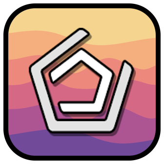

# Geodify
A mod made to to change most menus' backgrounds to the Geode one 



## Building

To build this mod, follow one of the methods below:

### VS Code

1. Open the project in VS Code.
2. Install the necessary dependencies (if not already done).
3. Select the appropriate build kit for your platform. You can do this by navigating to the "CMake Tools" tab in the bottom left and selecting "Select a Kit".
4. Choose the correct kit for your environment (e.g., macOS, Windows, etc.).
5. After selecting the kit, you can build the project by clicking "Build" in the "CMake" tab or by using the terminal command:

```bash
cmake --build .
```
This will compile the mod and generate the necessary files.

### GitHub Actions

1. Push your changes to GitHub.
2. Open the repository and navigate to the Actions tab.
3. Select the workflow called "Build Geode Mod".
4. Choose the latest commit.
5. After the build is complete, download the generated artifacts from the build step to get the built mod files.

## Adding Layers

### Geometry Dash

To add a custom background layer to a **Geometry Dash** menu, follow the example below. This demonstrates how to add a background layer in `CreatorLayer`.

```cpp
#include "../SwelvyBG.hpp"
#include <Geode/Geode.hpp>
#include <Geode/modify/CreatorLayer.hpp>

using namespace geode::prelude;

class $modify(MyCreatorLayer, CreatorLayer) {
	bool init() {
		if (!CreatorLayer::init()) {
			return false;
		}
		if (Mod::get()->getSettingValue<bool>("show-creator")){
			if (auto bg = this->getChildByID("background")){
				bg->setVisible(false);
			}

			auto swelvyBG = SwelvyBG::create();
			swelvyBG->setZOrder(-2);
			swelvyBG->setID("swelvy-background");

			this->addChild(swelvyBG);
		}
		return true;
	}
};
```


### External Mods

For external mods that modify the background of a specific menu, you can use the following example. This shows how to hook into `GlobedLevelListLayer` to add a custom background.

```cpp
#include <Geode/Geode.hpp>
#include "../../SwelvyBG.hpp"
#include "../../Hooks/Hooker.hpp" 
using namespace geode::prelude;

Viper_Hookclass(GlobedLevelListLayer) {
        if (auto bg = this->getChildByID("background")) {
            bg->setVisible(false);
        }

        SwelvyBG* swelvyBG = SwelvyBG::create();
        swelvyBG->setZOrder(-1);
        swelvyBG->setID("swelvy-background");
        this->addChild(swelvyBG);
}

```
This way is new from v1.6.0+!

### External Mods Fix

For external mods that really don't like you to modify the background of a specific menu, you can use the following example. This shows how to hook into `cvolton.betterinfo/CustomCreatorLayer` to add a custom background.

Please do not do this unless like in this example it's the only way since Viper_Hookclass won't work on it!

```cpp
#include <Geode/Geode.hpp>
#include "../../SwelvyBG.hpp"
#include "../../Hooks/Hooker.hpp" 
using namespace geode::prelude;
// class name to store in code, Hook to (the real layer id)
Viper_Hookclass_Scene(cvolton_betterinfo_CustomCreatorLayer,"cvolton.betterinfo/CustomCreatorLayer") {
         if (auto bg = _This->getChildByID("cvolton.betterinfo/background")) {
            bg->setVisible(false);
            SwelvyBG* swelvyBG = SwelvyBG::create();
            swelvyBG->setZOrder(-1);
            swelvyBG->setID("swelvy-background");
            _This->addChild(swelvyBG);
        }
}
```
This way is new from v1.6.0+!
